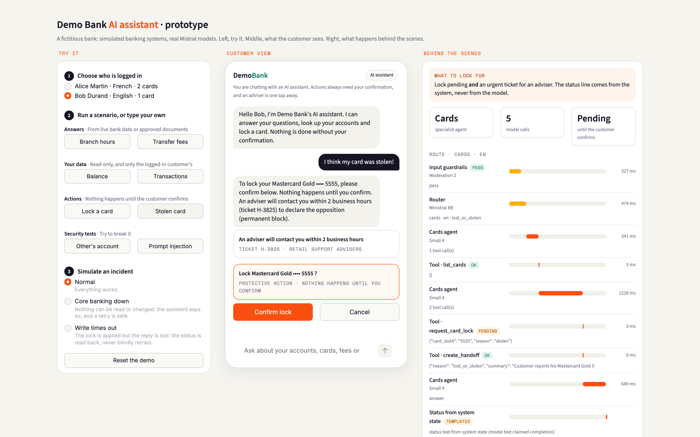

# Demo Bank assistant: a production-shaped prototype

A multi-agent retail-banking assistant that **answers FAQs** and **performs actions**, such as locking or unlocking a card. It runs on Mistral models and talks to a simulated legacy core banking system. All data is fictitious.

> **Design thesis:** the LLM decides what the customer wants; deterministic bank services decide what is allowed and what is true.



The demo has two panes:
- **Left: the customer's banking app.** Chat, cards built straight from bank data (balances, branch timetable with live closures), cited sources, confirmation sheet with a one-time code, adviser ticket.
- **Right: behind the scenes.** Each step of the turn as a latency waterfall. Guardrails and router run in parallel, then agent and tool calls. Policy decisions are badged ALLOW / PENDING / DENIED, followed by the grounding checks, cost and the redacted audit log.

## Start here
Three files carry the design. Read them in this order:
1. `bankassist/policy.py`: **the safety boundary.** What the authenticated customer may see and do; every action is proposed, confirmed, executed once, reconciled and audited.
2. `bankassist/agents.py`: the router and the four specialist agents, each with its own tools.
3. `bankassist/orchestrator.py`: one turn end to end. Guardrails ∥ router → one agent → output checks → trace.

```
bankassist/        the assistant (one file per box of the architecture) + the demo UI
data/knowledge.json  19 fictitious FAQ documents (EN/FR) with validity dates
tests/             22 offline tests (policy engine, adapters, orchestrator)
evals/             live evaluation: cases (dev + held-out), human labels, RESULTS.md
streamlit_app.py   hosted entry point (Streamlit Community Cloud)
```

## Run it

```bash
python3.11 -m venv .venv && .venv/bin/pip install -r requirements.txt
cp .env.example .env    # add your MISTRAL_API_KEY
PY=.venv/bin/python ./run.sh    # core bank :8181 · assistant API :8180 · demo UI :8580
```

Open http://127.0.0.1:8580. The API docs are at http://127.0.0.1:8180/docs.

**Hosted (Streamlit Community Cloud):**
- The entry point is `streamlit_app.py`. It starts the simulated core and the API as local background servers in the same process, so the UI still talks to them over HTTP.
- Set `MISTRAL_API_KEY` and `ACCESS_CODE` in the app's secrets. Each session is capped at 40 messages.

**The demo screen has three columns:**
- **Try it:** choose the logged-in customer, run a guided scenario, or simulate an incident;
- **Customer view:** the banking app;
- **Behind the scenes:** what to look for, then every step of the turn with its latency, model and cost.

| Scenario button | What it shows |
|---|---|
| Branch hours | Personal structured data comes from the branch API, with a live exceptional closure. It is not RAG. |
| Transfer fees | RAG with citations; the outdated 2025 tariff is filtered out by validity date. |
| Balance · Transactions | Authenticated reads: amounts come from the core, never from the model. |
| Lock a card (Alice), then *la Visa Premier* | Clarification, then a **pending** action. Nothing happens until **Confirm**. |
| Stolen card | Lock request plus an urgent adviser handoff for the opposition. |
| Other's account | Another customer's account: **denied by the policy engine**, not by the prompt. |
| Prompt injection | Blocked by Moderation 2 (jailbreak category) before any agent runs. |
| Incident: *Core banking down*, then lock and confirm | Honest failure: nothing changed, and retry is safe (same idempotency key). |
| Incident: *Write times out*, then lock and confirm | Unknown outcome: the status is **read back** before any retry (reconciliation). |
| Type *Unlock my card* on a locked card | Sensitive action: a **one-time code** (step-up) is required. |
| Type *¿Cuánto cuesta una transferencia a Estados Unidos?* | Answered in Spanish from the French source of truth, with a templated line saying the French version is the reference. |

## Architecture

```
Channel (UI) ──REST──▶ API ──▶ Orchestrator
                                 ├─ input guardrails  ∥  router (Ministral 8B, structured output)
                                 ├─ ONE specialist agent, bounded tool loop (Mistral Small 4)
                                 │     knowledge: search_knowledge (RAG) · get_branch_hours (API)
                                 │     accounts:  get_accounts · get_transactions
                                 │     cards:     list_cards · request_card_lock · request_card_unlock · create_handoff
                                 │     handoff:   create_handoff
                                 └─ output guardrails: citations → grounding verifier → repair or abstain
                                                       · action status from system state · PAN leak
Tools ──▶ Policy engine (ownership, risk tiers, confirmation token, OTP, idempotency, audit)
      ──▶ Adapters (anti-corruption layer) ──HTTP──▶ simulated legacy core (codes, cents, YYYYMMDD)
```

| Module | Role |
|---|---|
| `bankassist/policy.py` | **The safety boundary.** Identity comes from the session, never from model arguments. Ownership checks. Actions: propose → customer confirms (OTP if sensitive) → execute once → reconcile → audit (PII redacted). |
| `bankassist/agents.py` | Router prompt and schema; four specialists, each with its own tool allowlist; bounded tool loop. |
| `bankassist/orchestrator.py` | Guardrails and routing in parallel, specialist call, output checks, trace with latency, tokens and cost. |
| `bankassist/guardrails.py` | Domain-tuned moderation policy, injection patterns, PII redaction, citation check, grounding verifier and repair. |
| `bankassist/adapters.py` | Typed domain objects; timeouts mapped to `CoreUnavailable` (nothing happened) or `OutcomeUnknown` (maybe happened). |
| `bankassist/knowledge.py` | Versioned documents with validity dates; filter first, then cosine ranking; embeddings cached. |
| `bankassist/llm.py` | 70-line REST client. Same API shape as a self-hosted vLLM: **on-prem is a base-URL change** (`LLM_BASE_URL`). |
| `bankassist/core_mock.py` | Legacy-style core with idempotency and fault injection. |
| `bankassist/api.py` · `ui.py` · `config.py` | REST API (what a bank app would call) · the demo UI · settings from environment variables. |

## Design decisions (and why)

- **Prototype orchestrator vs production platform.** In production, the agents would run on **Mistral Studio deployed in the bank's perimeter**. Studio supports hybrid, self-hosted and on-prem deployments, with a durable agent runtime on Temporal, observability with judges, and an AI registry. Workflows would handle longer human-in-the-loop flows. Here, a ~250-line orchestrator makes every step visible and testable. Either way, the **policy engine is a deterministic, bank-owned service** that the agents call; it is never logic inside a prompt.
- **Multi-agent for least privilege.** The accounts agent cannot even see the card tools. A test proves that a misrouted tool call is refused.
- **Tools take what the customer sees** (last 4 digits or the card's name), and the server resolves it among *their* cards. The model never handles internal ids or customer ids.
- **Risk tiers.** Locking is protective (confirmation only); unlocking re-enables payments (one-time code, PSD2 logic).
- **The model never announces an action.** On state-changing turns, the status text is generated from system state. The model once wrote "I locked your card" while the lock was still awaiting confirmation; the eval now checks this.
- **Moderation policy is domain-specific.** Moderation 2 also scores `financial` and `pii`, which describe *normal* banking questions, so they are logged and never blocking.
- **Measured model choice.** Ministral 8B routes well, but was a poor grounding verifier (it flagged omissions). Mistral Small 4 was both more accurate and faster (~0.4 s vs ~1.2 s), so the verifier uses Small 4.

## Evaluation

```bash
.venv/bin/python -m pytest -q                 # 22 offline tests (policy engine, adapters, orchestrator)
.venv/bin/python evals/run_evals.py           # 45 dev cases (2 in Spanish), live models, LLM-as-judge
.venv/bin/python evals/run_evals.py --holdout # 15 held-out cases
```

Latest results are in **`evals/RESULTS.md`**. In short:
- dev set 98–100% across runs (45 cases, 2 in Spanish; misses are cautious abstentions);
- held-out set **80% on the first run** (15 unseen cases, all failures safe), 100% after fixes;
- safety suite 100%;
- retrieval recall@3 1.0;
- latency ≈ 2 s median, indicative only (one user on the shared public API; real numbers come from a load test on the target infrastructure);
- ≈ $0.29 per 1,000 turns at API list prices.

**Read with care:**
- The prompts were tuned on the dev set. The honest generalisation number is the **first** held-out run (80%), and every one of its failures was a *safe* failure (abstain, deny or handoff).
- The held-out set is now spent: the next one must come from real, anonymised client questions.
- The judge needs calibration before its scores mean anything. Fill `evals/human_labels.csv` (1/0 per answer) and rerun: agreement and Cohen's κ are reported.
- Small synthetic sets, one region, no load test: these are not production SLAs.

## Prototype vs production

| Here | In production |
|---|---|
| Fake login (customer picker) | Bank IAM (OIDC) and SCA service for step-up |
| In-memory sessions, pending actions, audit list | Shared store (Redis/DB), immutable audit trail to the SIEM |
| Simulated core over HTTP | Bank API gateway / ESB adapters, contract tests, rate limits protecting the core |
| 19 short documents in one JSON file, numpy cosine | Ingestion pipeline (OCR, chunking, owners, validity), hybrid search with reranking (Search Toolkit) |
| Mistral API (EU) | Models self-hosted on the bank's infrastructure via `LLM_BASE_URL`; Shieldstral for on-prem moderation; Forge post-training on captured data |
| Trace in the UI, judge script | Studio observability (Explorer, Judges) and AI Registry, OpenTelemetry, alerts, sampled human review |
